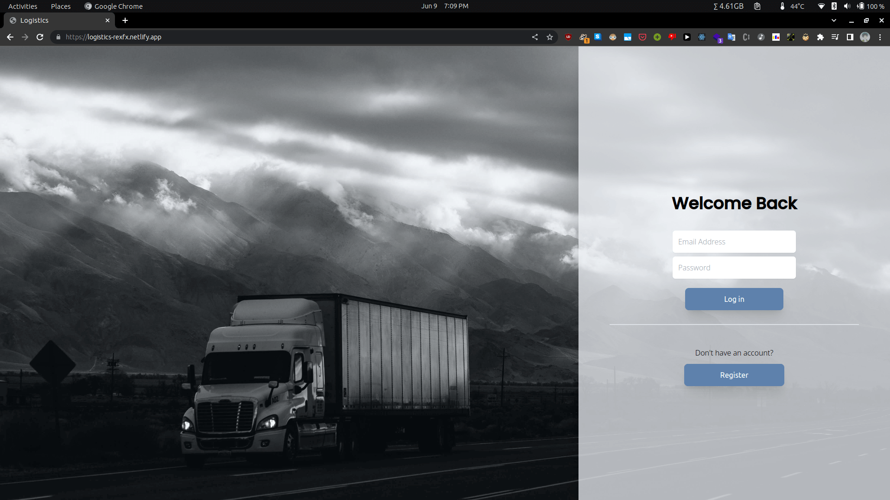
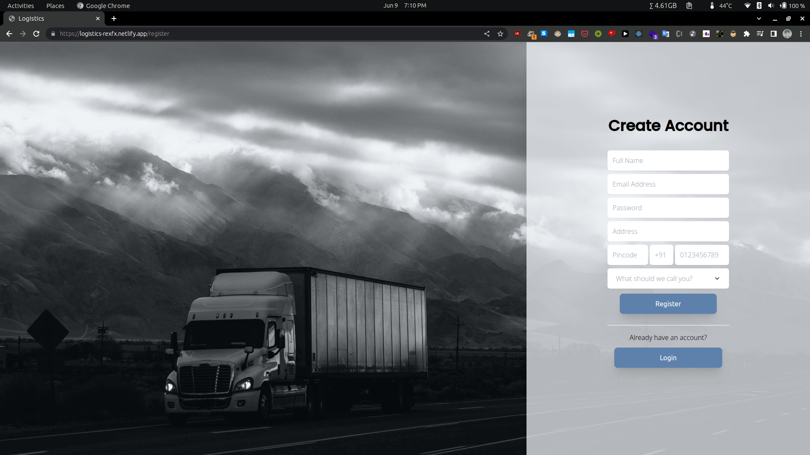
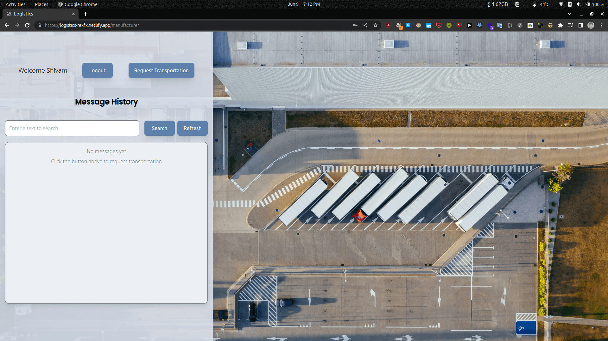
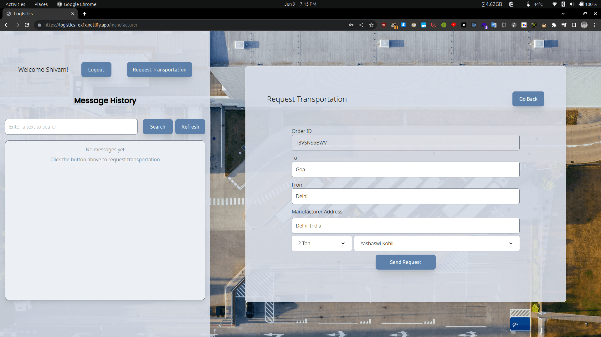
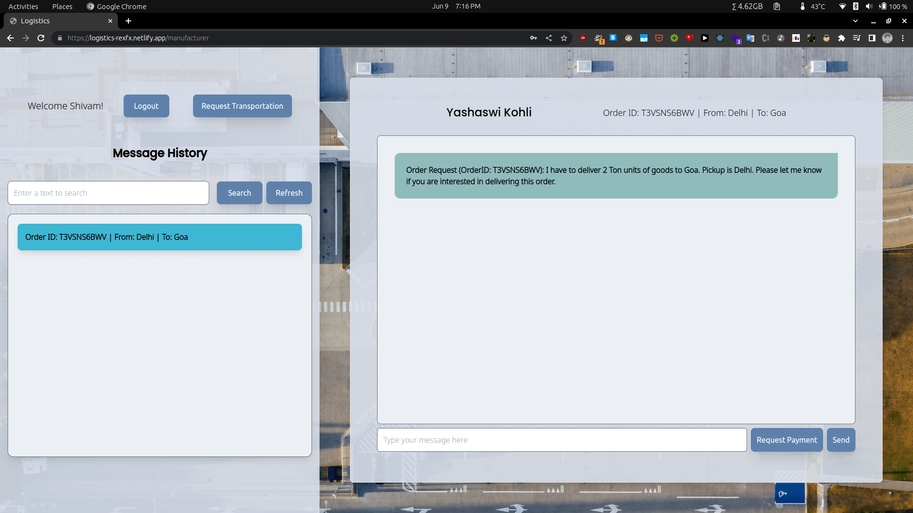
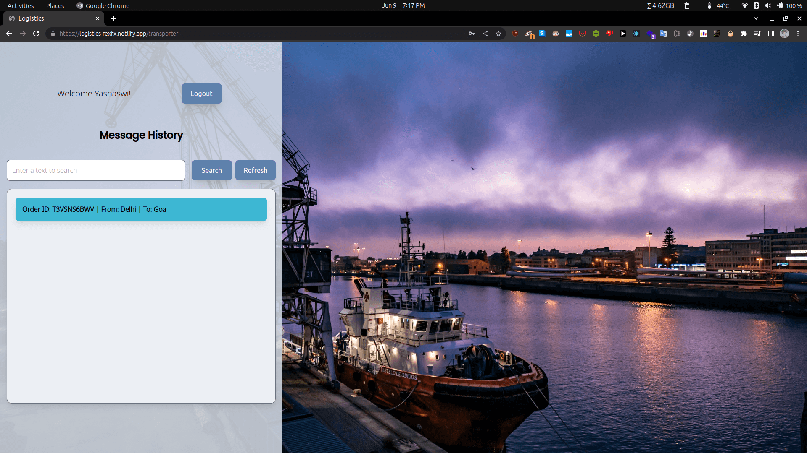
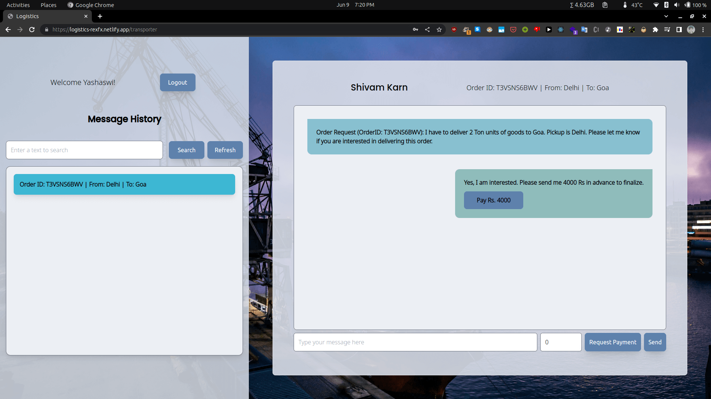
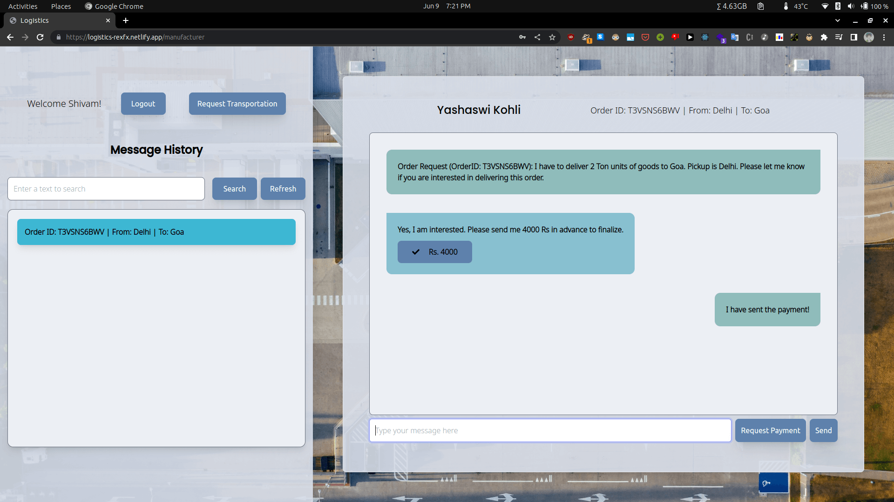

# Logistics Web App

-   Backend: https://github.com/rexFX/Logistics-Backend

>   Testing:
>   
>   Manufacturer email: shivam@karn.com
>   Pass: 123456
>   
>   Transporter email: yashy@kohli.com
>   Pass: 123456

### Features:

-   Login and Registration functionality
-   Messaging functionality, used websockets (socket.io) for chat and update payment feature.
-   You can send payment request, can also implement some actual payment method in future according to needs in the backend.
-   Manufacturers can create new order requests with registered Transporters. The options are auto-populated at login along with saved address and order ID.

### Screenshots:

